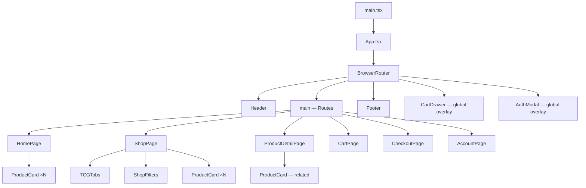
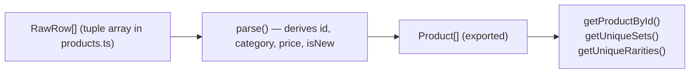

# Architecture

## System Overview

TCG Pond is a **single-page application (SPA)** with no server-side runtime. All data lives in-memory (the product catalogue is bundled JavaScript) and user state is persisted to `localStorage` via Zustand middleware. A real backend can be grafted in by replacing the simulated `login`/`register` functions in `authStore.ts` and introducing an API layer for products.

---

## Component Hierarchy



---

## Data Flow

```mermaid
flowchart LR
    subgraph Data Layer
        PD[products.ts\nstatic catalogue]
        TC[tcgConfig.ts\nTCG feature flags]
    end

    subgraph State Layer
        CS[cartStore\nZustand + persist]
        AS[authStore\nZustand + persist]
    end

    subgraph UI Layer
        SHP[ShopPage]
        PDP[ProductDetailPage]
        CHK[CheckoutPage]
        ACC[AccountPage]
        CDR[CartDrawer]
        HDR[Header]
    end

    PD -->|products[]| SHP
    PD -->|getProductById| PDP
    TC -->|enabledTCGs| SHP

    SHP -->|addItem| CS
    PDP -->|addItem| CS
    CS -->|items, totalPrice| CDR
    CS -->|items, totalPrice| CHK
    CS -->|totalItems| HDR

    AS -->|user, orders| CHK
    AS -->|user, orders| ACC
    CHK -->|addOrder| AS
```

---

## State Management

Both stores use **Zustand** with the `persist` middleware. State is serialised to `localStorage` under a fixed key.

| Store | Key | Persisted Fields |
|---|---|---|
| `cartStore` | `tcg-pond-cart` | `items` |
| `authStore` | `tcg-pond-auth` | `user`, `orders` |

Stores are consumed directly via hooks in any component — no provider wrappers required.

---

## Routing

React Router v7 handles all navigation. Routes are defined in `App.tsx`:

| Path | Component | Notes |
|---|---|---|
| `/` | `HomePage` | Hero, new arrivals, categories, premium cards |
| `/shop` | `ShopPage` | Full catalogue with filters, search, pagination |
| `/product/:id` | `ProductDetailPage` | Single product view with related cards |
| `/cart` | `CartPage` | Full cart page (mirrors CartDrawer) |
| `/checkout` | `CheckoutPage` | Shipping → payment → confirmation |
| `/account` | `AccountPage` | Profile view |
| `/account/orders` | `AccountPage` | Order history (same component, path-based tab) |

Filter state is encoded in the URL query string (e.g. `?tcg=pokemon&category=single&sort=price-asc`) so links are shareable and the browser back button works correctly.

---

## Product Data Pipeline



The catalogue is a compact tuple array (`RawRow[]`) that is parsed once at module load time into the typed `Product[]`. This avoids JSON overhead and keeps the source easy to edit as a CSV-like structure.

`isNew` is computed at parse time: a product is "new" if its `dateAdded` is within 30 days of the reference date (`2026-04-06`).

`category` is derived from whether `cardNumber` is empty: an empty `cardNumber` means the item is a sealed product.

`price` resolves to `priceOverride` when non-zero, otherwise `marketPrice`.

---

## Styling Architecture

- **Tailwind CSS v3** with a custom design-token extension in `tailwind.config.js`
- The `pond-*` colour palette provides the dark background system
- Per-TCG colour pairs (`pokemon.primary`, `pokemon.accent`, etc.) allow dynamic tab/badge theming
- Custom animations `fade-in` and `slide-in` are used for the AuthModal and CartDrawer respectively
- No CSS-in-JS; all styling is utility-class based

---

## Key Technical Decisions

| Decision | Rationale |
|---|---|
| Static product data | No backend required; easy CSV-style edits; instant load |
| Zustand over Redux | Minimal boilerplate; direct hook consumption; built-in persist middleware |
| URL query string for filters | Shareable URLs; free undo/redo via browser history |
| Simulated auth | Allows full UI flow without a backend; replace `login`/`register` bodies only |
| Per-TCG feature flags | Enables/disables entire game tabs without deleting data |
| Shipping threshold logic | Free shipping ≥ $50; calculated purely client-side at checkout |
